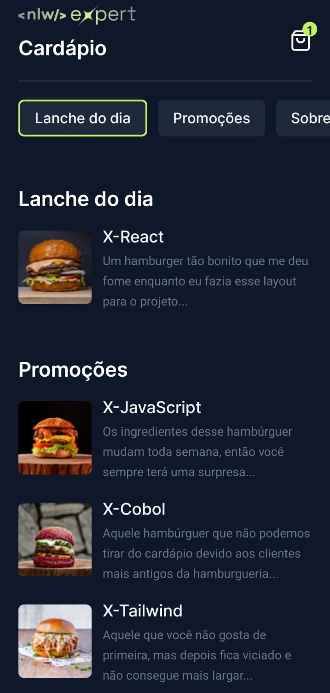

# Expert Cardápio-NLW
 <h1 align="center"> Cardápio </h1>

NLW é um evento exclusivo e gratuito, promovido pela Rocketseat para ensino de tecnologias MOBLIE e a partir dele foi possível desenvolver um projeto para a criação de um cardápio.  

  <a href="#-tecnologias">Tecnologias</a>&nbsp;&nbsp;&nbsp;|&nbsp;&nbsp;&nbsp;
  <a href="#-projeto">Projeto</a>&nbsp;&nbsp;&nbsp;|&nbsp;&nbsp;&nbsp;
  <a href="#memo-licença">Licença</a>

  

 

  

## 🚀 Tecnologias

Esse projeto foi desenvolvido com as seguintes tecnologias:

- Typescript
- Tailwind
- React Native
- Github
- Figma

## 💻 Projeto

A aplicação Expert Notes foi criada para o usuário pedir seus pratos de forma fácil a fim de facilitar o pedido tanto para quem está pedindo como para o restaurante, por isso para realizar todo o projeto se fez necessáiro a utilização de diversas tecnologias e APIs.

Para ter acesso ao aplicativo você pode baixar pelo link abaixo o APK e instalar em seu dispositivo android. Ou clonar esse projeto e usar o comando "npx expo start" em seu computador você poderá visualizar o mesmo pelo emulador. 

- [Baixe o aplicativo](https://drive.google.com/file/d/1iuZpsG3zsShvoB6e0apISHT_5Tl3Loui/view?usp=sharing)

## :memo: Licença

Esse projeto está sob a licença MIT.

---

Feito com ♥ by Helena Lima. 

